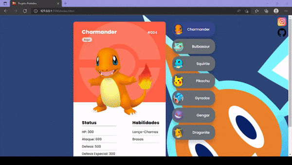
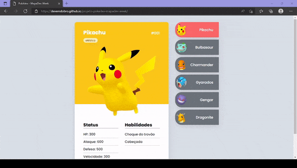

# Projeto-Pokedex
 Este projeto foi realizado durante a Semana MapaDev, da equipe [Dev em Dobro](https://github.com/devemdobro), ele consiste em basicamente uma simples pokedex, ou seja, um categorizador de pokemons.

---

## Proposta do Projeto  
Projeto desenvolvido pelo gêmeos da devemdobro, [Acesse aqui o projeto padrão](https://github.com/devemdobro/projeto-pokedex-mapadev-week).

